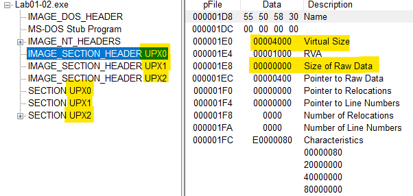
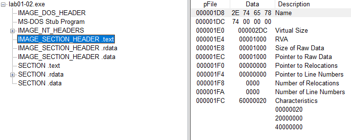
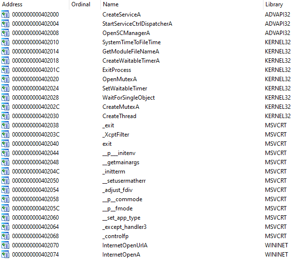

# Lab 1-2

### Q1 : Upload the files ```Lab01-02.exe``` to [VirusTotal](https://www.virustotal.com/gui/home/upload). Does it match any existing antivirus definitions ?  
#### Answer :  
Lab01-02.exe : 55/69 antivirus deteteced this file as malicious  

### Q2 : Are there any indications that this file is packed or obfuscated ? If so , what are these indicators ? if the file is packed, unpack it if possible.  
#### Answer :  
This file seems packed with UPX  
  

We can try to unpack the executable with UPX :  
```./upx -d lab01-02.exe```

result :    


Now back to PEview.  


Success !  

### Q3 : Do any imports hint at this program's functionality ? If so, which imports are they and what do they tell you ?  
#### Answer :  
```Lab01-02.exe``` imports :  
   

We see that the malware is able to communicate through http (```InternetOpenUrlA```, ```InternetOpenA```), create threads and manipulate service. It's also using timer.  


### Q4 : What host or network-based indicators could be use to identify this malware on infected machines ?  
#### Answer :  
We can look for strings :  
  
We can check for machines trying to access ```http://www.malwareanalysisbook.com``` or look for process/service named : ```MalService```, ```Malservice``` or ```HDL345```  