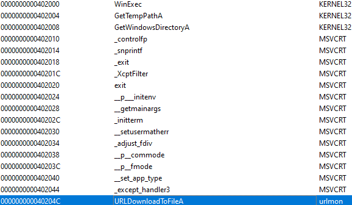

# Lab 1-4  

### Q1 : Upload the files ```Lab01-0.exe``` to [VirusTotal](https://www.virustotal.com/gui/home/upload). Does it match any existing antivirus definitions ?  
#### Answer :  
Lab01-04.exe : 58/70 antivirus deteteced this file as malicious  

### Q2 : Are there any indications that this file is packed or obfuscated ? If so, what are these indicators ? if the file is packed, unpack it if possible.  
#### Answer :    
None of the software I used detected a packer. But the virtual size and the size of raw data have a not so small difference (this is hex representation).  


### Q3 : When was this program compiled ?
#### Answer :  
Lab01-04.exe : 2019-08-31 00:26:59  
resource executable : 2011-02-27 01:16:59  

The timesptamp of ```Lab01-0.exe``` has been changed (the date is greater than the date of the release of the book + labs).  
We can assume that the real compile time is the compile time of the ressource executable (see question 6).

### Q4 : Do any imports hint at this program's functionality ? If so, which imports are they and what do they tell you ?  
#### Answer :  
  
We see that it may play with process privilege (ADVAPI32), create threads, manipulate files and load resource.

### Q5 : What host or network-based indicators could be use to identify this malware on infected machines ?  
#### Answer :  
Look for files  
 * "\\system32\\wupdmgr.exe"
 * "\\winup.exe"
 * "\\updater.exe" (downloaded)

### Q6 : This file has one resource in the resource section. Use Resource Hacker to examine that resource, and then use it to extract the resource. What can you learn from this resource ?  
#### Answer :  
I used ResourceHacker to examine the resource. This is the result :  
  
We immediatly see the famous ```MZ``` string suggesting this ressource is in fact a PE executable. So, I saved the resource with a ```.exe``` extension then opened it with IDA pro and it worked !  
  
Let's see the strings :  
  
  
And imports :  
  
  
There is a suspicious ```URLDownloadToFileA``` function with a string ```http://www.practicalmalwareanalysis.com/updater.exe```. A next step in the analysis is to download this updater and analyze it.  
  
  
And we indeed downloaded this mysterious updater.  
  
  
This is disapointing...  